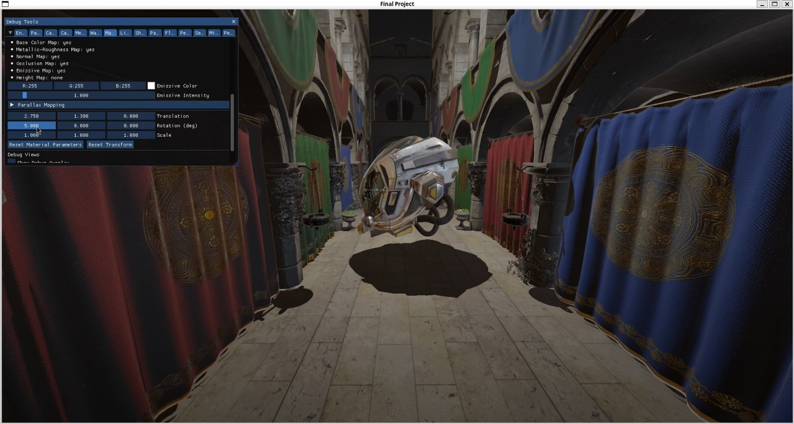
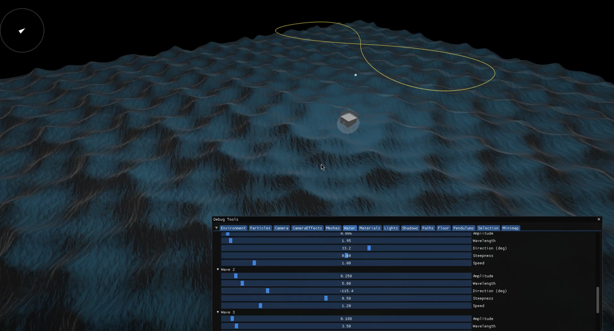

# Daedalus Engine

**Daedalus Engine** is a real-time OpenGL playground with physically based lighting, cinematic post-processing, and interactive scene editing.

Inspired by the maker behind the Labyrinth, **Daedalus Engine** is about experimenting for the sake of a it and the joy of watching an idea turn into something that actually runs. It started as a computer graphics course assignment, but the scope happily spiraled once we realized how much fun we were having .

---

<p align="center">
	
	
</p>


## Overview

- Physically-Based Rendering with image-based lighting, dynamic shadows, and multi-light support
- Post-processing suite featuring bloom, depth of field, film grain, color grading, vignette, and more
- Runtime workflows for loading models, adjusting lights, and planning smooth camera paths with keyframes
- Water simulation, particle effects, transparency, and minimap

---

## Build Instructions

This project uses **CMake** for configuration and compilation.
```bash
mkdir build && cd build
cmake ..
cmake --build . -j $(nproc)
```

> Launch the executable from the build directory so shader and asset paths resolve correctly.

---

## Learn More

Curious about implementation notes or extra screenshots? Check out [`report/report.md`](report/report.md) for some more details!

## Developpers
This projects was made by [shadygm](https://github.com/shadygm) and [cookie123](https://github.com/cookie232).
